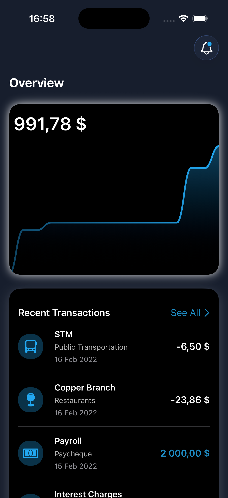
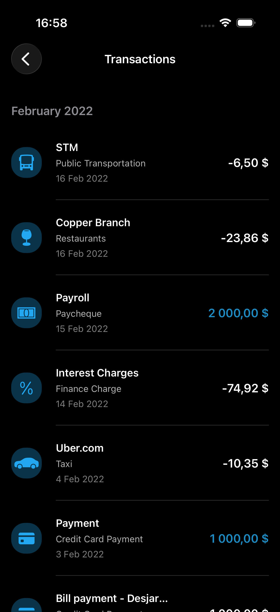
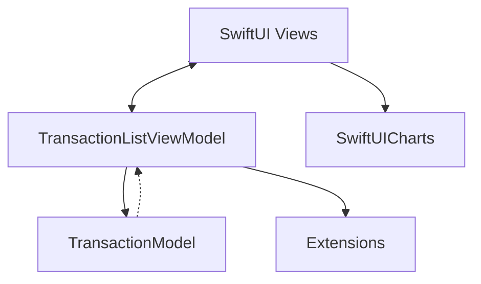

# 💸 ExpenseTracker - iOS App

<div align="center">
  
  
  
  
</div>

<p align="center">
  <strong>Красивое и удобное iOS приложение для отслеживания личных финансов с наглядными графиками</strong>
</p>

<div align="center">
  
  
</div>

## 🎓 О проекте

Приложение разработано в образовательных целях на основе отличного видеоурока на YouTube. 
Оригинальный туториал можно посмотреть здесь: [Build a SwiftUI App - Expense Tracker](https://www.youtube.com/watch?v=Bu6fAlltatA).

## ✨ Основные возможности

| Функция | Описание |
|---------|----------|
| 📊 **Наглядные графики** | Визуализация изменения баланса с помощью интерактивных линейных графиков |
| 💸 **Учет транзакций** | Удобный просмотр последних доходов и расходов с красивыми иконками категорий |
| 📁 **Группировка по месяцам** | Автоматическая сортировка и группировка истории операций по месяцам и дням |
| 🌓 **Поддержка тем** | Полная и нативная поддержка как светлой, так и тёмной темы iOS |
| 🎨 **Современный UI** | Плавные анимации, скругленные карточки и размытие фона (Glassmorphism) |

## 🏗️ Архитектура

Приложение построено с использованием паттерна **MVVM** (Model-View-ViewModel) для четкого разделения логики и пользовательского интерфейса:



### Технологический стек:
- **UI Framework**: SwiftUI
- **Архитектура**: MVVM (Model-View-ViewModel)
- **Графики**: Сторонняя библиотека `SwiftUICharts`
- **Коллекции**: Apple `swift-collections` для оптимизированной работы с данными

## 📦 Зависимости (SPM)

В проекте используются следующие пакеты Swift Package Manager:
- **`swift-collections`** (1.5.0) — для использования `OrderedDictionary` при группировке транзакций.
- **`SwiftUICharts`** (2.0.0-beta.2) — для отрисовки красивого графика на главном экране.

## 📁 Структура проекта

```text
ExpenseTracker/
├── 📱 App/
│   └── ExpenseTrackerApp.swift        # Точка входа в приложение
├── 🛠 Extensions/
│   └── Extensions.swift               # Расширения для цветов, дат и форматов
├── 📊 Model/
│   └── TransactionModel.swift         # Модель данных транзакции и категории
├── 🧠 ViewModel/
│   └── TransactionListViewModel.swift # Логика обработки и группировки данных
├── 🖼 Views/                          # SwiftUI компоненты
│   ├── ContentView.swift              # Корневое представление с навигацией
│   ├── RecentTransactionList.swift    # Блок последних транзакций на главном экране
│   ├── TransactionList.swift          # Полный список транзакций с группировкой
│   ├── TransactionRow.swift           # Дизайн отдельной ячейки транзакции
│   └── Assets.xcassets                # Цвета и иконки
└── 🧪 Preview Content/
    ├── PreviewData.swift              # Моковые данные для Canvas превью
    └── Preview Assets.xcassets        # Ассеты для превью
```

## 🚀 Быстрый старт

### Требования
- **macOS**: 12.0+ (Monterey или новее)
- **Xcode**: 14.0+
- **iOS**: 15.0+

### Установка

1. **Клонирование репозитория**
   ```bash
   git clone https://github.com/ТВОЙ_NICKNAME/ExpenseTracker.git
   cd ExpenseTracker
   ```

2. **Открытие проекта**
   ```bash
   open ExpenseTracker.xcodeproj
   ```

3. **Загрузка зависимостей**
   - Дождитесь пока Xcode автоматически подтянет пакеты `swift-collections` и `SwiftUICharts` (File -> Packages -> Resolve Package Versions).

4. **Сборка и запуск**
   - Выберите нужный симулятор (например, iPhone 14 Pro)
   - Нажмите `Cmd + R` или кнопку ▶️ Play в Xcode

## 📖 Использование

1. **Главный экран (Overview)**
   - Наверху отображается график баланса. Вы можете провести по нему пальцем (если поддерживается библиотекой), чтобы увидеть значения.
   - Ниже представлен список недавних транзакций (Recent Transactions).

2. **Просмотр всех операций**
   - Нажмите кнопку `See All >` в блоке недавних транзакций.
   - Откроется экран, где все ваши доходы и расходы удобно сгруппированы по месяцам.

3. **Темная тема**
   - Измените тему системы в настройках симулятора (`Cmd + Shift + A`), чтобы увидеть, как приложение красиво адаптируется под темный режим.

---

<div align="center">
  <p>⭐ Поставьте звезду, если вам понравился этот проект!</p>
</div>
